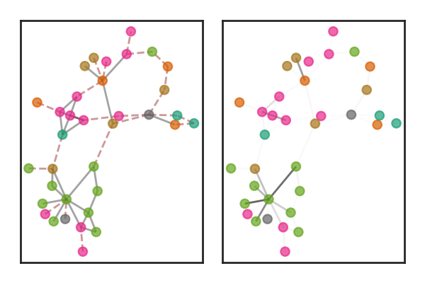

# Variational Graph Convolutional Networks

Implementation of the paper "Variational Inference for Graph Convolutional Networks in the Absence of
Graph Data and Adversarial Settings", accepted for publication at NeurIPS 2020. The paper will be publicly available 
from the [NeurIPs website](https://neurips.cc/) but a preprint can be found in [arXiv](https://arxiv.org/abs/1906.01852).

## Requirements
This code has been tested in Python 3.6.8. Once you have a copy of the source, you can navigate to the root directory and  create a new virtual environment (recommended):

    $ virtualenv ~/VGCN-env --python=python3.6 
 
 Then you can activate your environment:
    
    $ source ~/VGCN-env/bin/activate
 
 and install requirements with:

    $ pip install -r requirements.txt

## Running Examples
There are two scripts that will run examples of the experiments described in the paper.

### No graph case
To run an example of the no-graph case by building a prior based on a KNNG:

From your working directory, run

    $ ./experiments/example_nograph.sh

This runs an example of the no-graph case on the CiteSeer dataset and saves the results in the local directory ./results/test_knn.

### Adversarial case
To run an example of the adversarial case on a graph corrupted by adversarial noise:

From your working directory, run

    $ ./experiments/example_adversarial.sh

This runs an example of the adversarial setting on the CiteSeer dataset for a specific adversarially-corrupted graph and saves the results in the local directory ./results/test_adversarial

## Authors
[Pantelis Elinas](http://tiny.cc/lcsr8y),
[Edwin V. Bonilla](https://ebonilla.github.io/) and 
[Louis Tiao](https://tiao.io/).

## License

This project is licensed under the MIT License.

